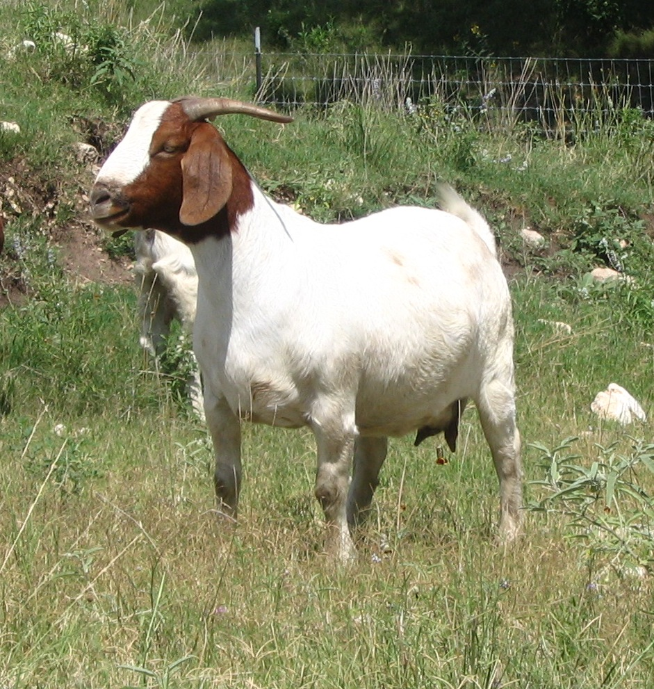
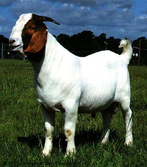

```html
<!DOCTYPE html>
<html>

<head>
    <title>GOATS IN SPACE!</title>
    <link href='http://fonts.googleapis.com/css?family=Asap:400,700' rel='stylesheet' type='text/css'>
    <style type="text/css">
    body {
        background-color: black;
        margin: 5% 15% 0 15%;
        overflow: hidden;
    }

    .img {
        width: 100px;
        height: 100px;
    }

    .box {
        text-align: center;
        float: right;
        width: 150px;
        height: 150px;
        margin: 10px;
    }

    #wrapper {
        width: 510px;
        margin: 0 auto;
    }
    </style>
</head>

<body>
    <div id="wrapper">
        <div class="box">
            
        </div>
        <div class="box">
            
        </div>
        <div class="box">
            
        </div>
        <div class="box">
            
        </div>
        <div class="box">
            
        </div>
        <div class="box">
            
        </div>
        <div class="box">
            
        </div>
        <div class="box">
            
        </div>
        <div class="box">
            
        </div>
    </div>
    <!-- load scripts after dom has been rendered -->
    <script src="https://cdnjs.cloudflare.com/ajax/libs/gsap/1.18.0/TweenMax.min.js"></script>
    <script src="https://code.jquery.com/jquery-2.1.4.js"></script>
    <!-- Our custom script -->
   <body>
  </html>
```
