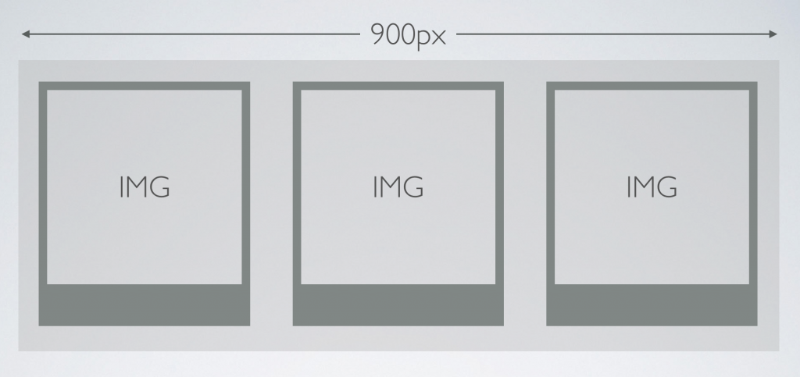
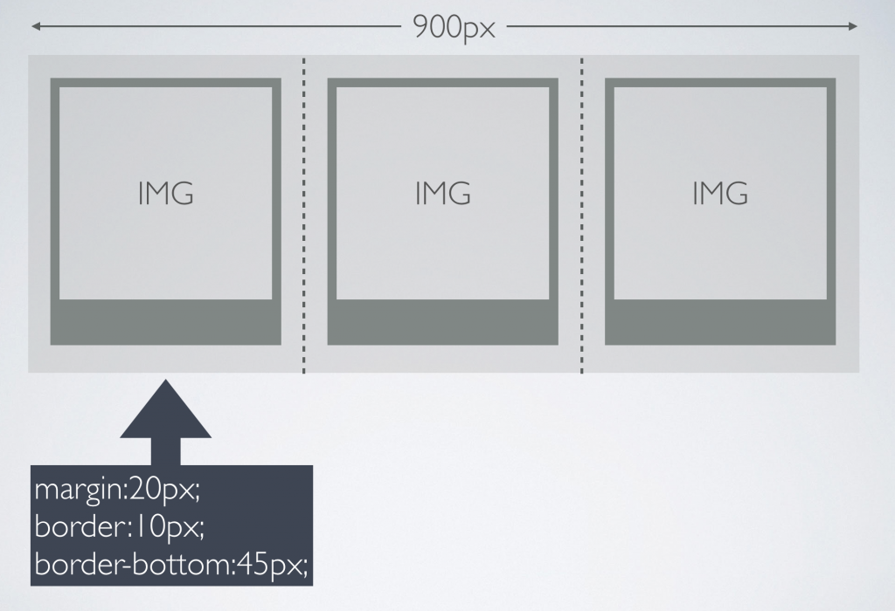

# Box Model and Simple Layouts Using CSS

Today we are going to make a single page image gallery about NYC.

## Box Model and Pixel Math

First let’s do a little math to make sure we can fit 3 images perfectly spaced within a 900px container div that is centered on the page.



[W3 Schools Box Model Explained](http://www.w3schools.com/css/css_boxmodel.asp)

We are going to use margins for transparent space between each image container, and borders to create the “polaroid” uneven border around the image.



So if we are trying to fit 3 polaroids perfectly within our 900px container, what is the width of each div?

```
900px/3 = 300px 
(remember this includes margins and borders!)
```

So if we have 300px to work with, we need to first subtract our margins from either side:
```
300px - 40px = 260px 
(remember to subtract 20px twice for the right margin and the left margin)
```

OK. We are down to 260px to work with. But what about the border? Remember, unlike margins, borders and padding both add dimension to an element’s width.
```
260px - 20px = 240px
(remember we have 10px on the left AND right so we need to subtract 20px, not 10px)
```
### In Class Exercise:
What if our container div is 1000px wide and we want to fit 4 images per row with a margin of 10px on each side and a border of 10px?

```
.container{
  width: 1000px;
  /*set the top/bottom margins to 0, and the left/right to auto to center the container in the page*/
  margin:0 auto;
}

.polaroid{
  margin:10px;
  border:10px;
  width: ??px;
}
```

## Float, Clear and Inline Block

* Block elements want to take up the entire width of the page/containing element.

* Inline elements will keep stacking on the right as long as there is enough space.

[W3 inline vs block elements](http://www.w3schools.com/html/html_blocks.asp)

```
.myInlineElement{
  display:inline;
}
```
```
.myBlockElement{
  display:block;
}
```
```
.myInlineBlockElement{
  display:inline-block;
}
```

Wait! What is inline-block? It is kind of the best of both worlds. We still need to define dimensions of our element in the CSS but we can stack elements without that pesky clearing nonsense!

[W3 inline block explained](http://www.w3schools.com/css/css_inline-block.asp)

## Positioning Elements:

Sometimes we need a little more control over where an element is positioned. Sometimes margins, padding, and layout grids just are not enough. We can do this using the CSS position property.

###Relative Fixed and Absolute:

Honestly, can’t say it any better than w3Schools. Also, CSS is a big crazy monster, and we would all get used to looking through documentation to figure out how to do exactly what we are trying to do. Here is a reference link explaining positioning:

[W3 Schools CSS position explained](http://www.w3schools.com/css/css_positioning.asp)

### Relative inside Absolute and Absolute inside Relative:
Sometimes we need to position elements within elements. When we do this, we need to make sure the parent element has a position defined as well.

### Live Code: NYC Gallery, Positioning, and Inline-Block